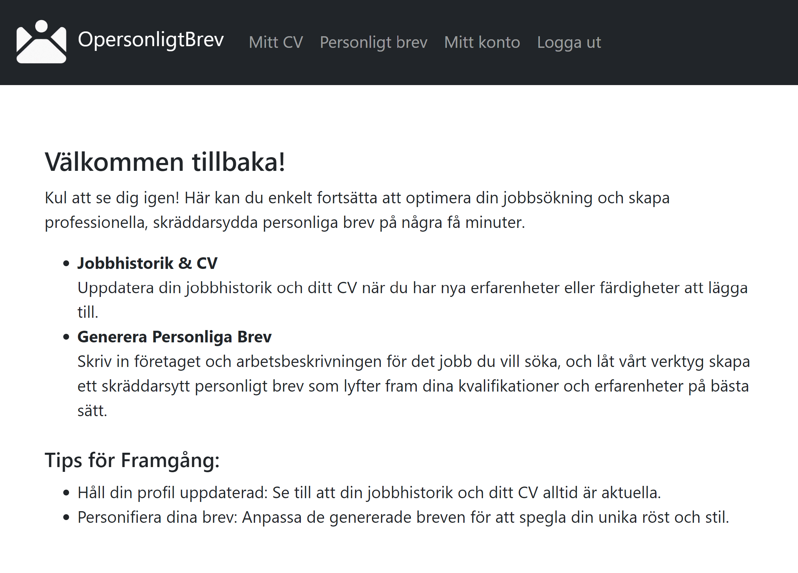
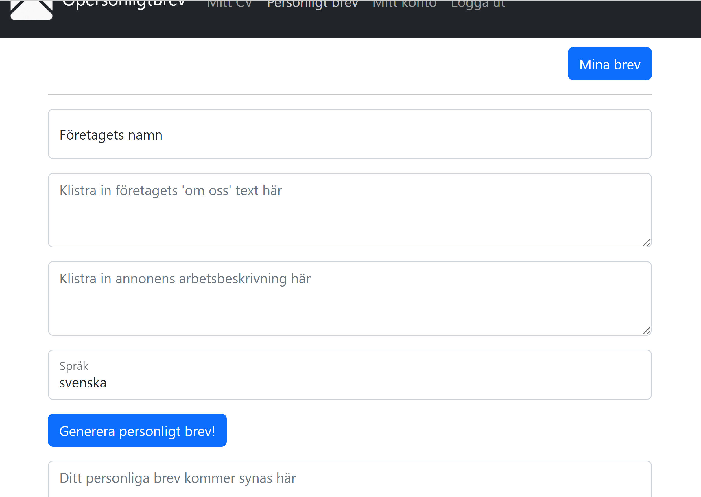
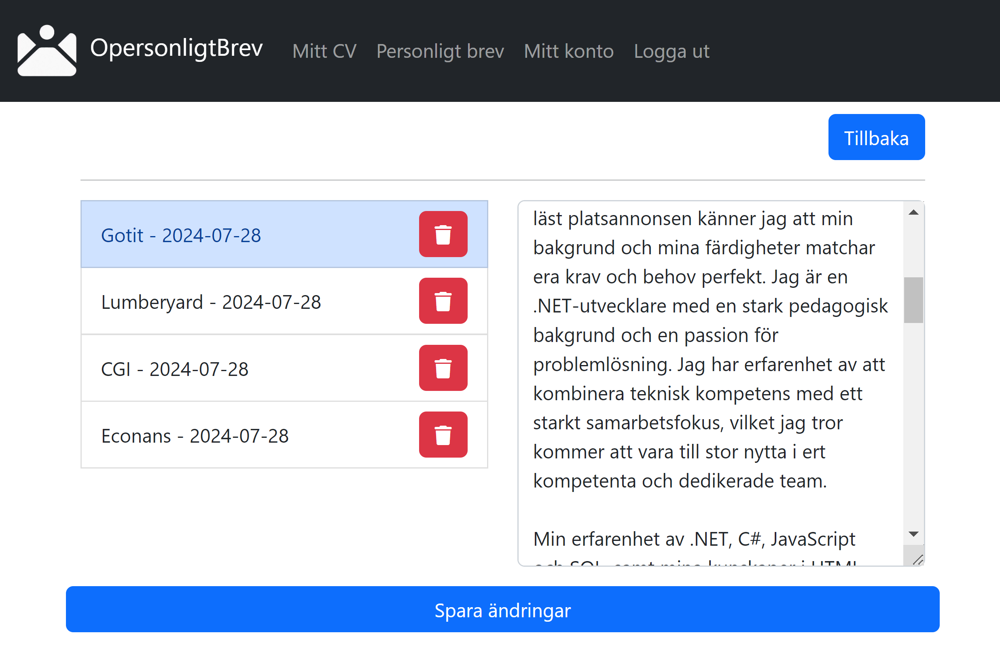

# OPersonligtBrev
## Om projektet
Att söka ett jobb ska inte handla om hur vältalig du är i skrift. Fokus bör vara på hur väl just din profil passar in på företaget du söker till. Detta är en webbapp som hjälper användaren att formulera övertygande personliga brev som tydligt kommunicerar varför användaren är en bra kanditat för tjänsten som efterlyses.  
Länk till appen: https://calm-tree-0af52a703.5.azurestaticapps.net/

### Hur du använder appen
<ol>
  <li>Bli medlem</li>
  <li>Fyll i din arbetshistorik under "Mitt CV"</li>
  <li>När du söker ett jobb klistrar du bara in arbetsannonsen och företagets "Om oss" text.</li>
  <li>Få jobbet!</li>
</ol>

## Tech-stack
<ul>
  <li>
    Blazor
  </li>
  <li>
    Asp.net core
  </li>
  <li>
    Microsoft SQL-server
  </li>
  <li>
    MongoDb
  </li>
  <li>
    Azure
  </li>
  <li>
    OpenAI
  </li>
</ul>

## Bilder

|Landningssida|
|------------------------|
| |

|Formulär för att generera ett personligt brev|
|------------------------|
|  |

|Lista över Personliga brev|
|------------------------|
|  |

